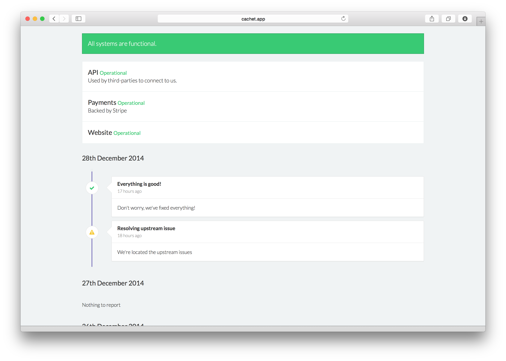

<!--
Este archivo README esta generado automaticamente<https://github.com/YunoHost/apps/tree/master/tools/readme_generator>
No se debe editar a mano.
-->

# Cachet para Yunohost

[](https://ci-apps.yunohost.org/ci/apps/cachet/)


[](https://install-app.yunohost.org/?app=cachet)

*[Leer este README en otros idiomas.](./ALL_README.md)*

> *Este paquete le permite instalarCachet rapidamente y simplement en un servidor YunoHost.*  
> *Si no tiene YunoHost, visita [the guide](https://yunohost.org/install) para aprender como instalarla.*

## Descripción general

Cachet is a status page for your API, service or company. Built with all of the features that you'd expect from a status page, Cachet comes with a powerful API, a metric system, multiple user support, two factor authentication for added security and is easy to get setup. A powerful, self-hosted alternative to StatusPage.io and Status.io.


**Versión actual:** 2.4.1~ynh1

**Demo:** <https://demo.cachethq.io>

## Capturas



## Documentaciones y recursos

- Sitio web oficial: <https://cachethq.io>
- Documentación administrador oficial: <https://docs.cachethq.io>
- Repositorio del código fuente oficial de la aplicación : <https://github.com/CachetHQ/Cachet>
- Catálogo YunoHost: <https://apps.yunohost.org/app/cachet>
- Reportar un error: <https://github.com/YunoHost-Apps/cachet_ynh/issues>

## Información para desarrolladores

Por favor enviar sus correcciones a la [rama `testing`](https://github.com/YunoHost-Apps/cachet_ynh/tree/testing).

Para probar la rama `testing`, sigue asÍ:

```bash
sudo yunohost app install https://github.com/YunoHost-Apps/cachet_ynh/tree/testing --debug
o
sudo yunohost app upgrade cachet -u https://github.com/YunoHost-Apps/cachet_ynh/tree/testing --debug
```

**Mas informaciones sobre el empaquetado de aplicaciones:** <https://yunohost.org/packaging_apps>
