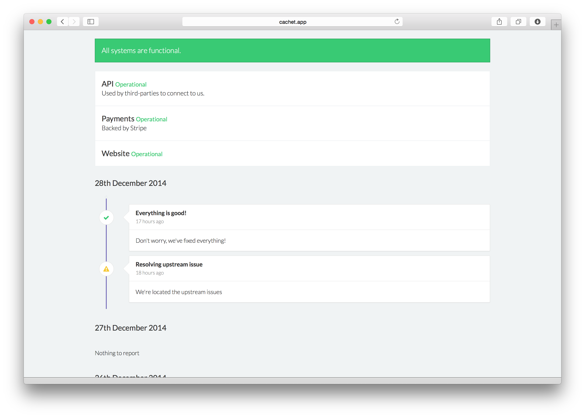

# Cachet pour YunoHost

[](https://dash.yunohost.org/appci/app/cachet)    
[](https://install-app.yunohost.org/?app=cachet)

*[Read this readme in english.](./README.md)*
*[Lire ce readme en français.](./README_fr.md)*

> *Ce package vous permet d'installer Cachet rapidement et simplement sur un serveur YunoHost.
Si vous n'avez pas YunoHost, regardez [ici](https://yunohost.org/#/install) pour savoir comment l'installer et en profiter.*

## Vue d'ensemble

[Cachet](https://cachethq.io/) is a free, open source status page for your API, service or company. Built with all of the features that you'd expect from a status page, Cachet comes with a powerful API, a metric system, multiple user support, two factor authentication for added security and is easy to get setup. A powerful, self-hosted alternative to StatusPage.io and Status.io.


**Version incluse :** 2.3.18~ynh2

**Démo :** https://demo.cachethq.io/

## Captures d'écran



## Documentations et ressources

* Site officiel de l'app : https://cachethq.io/
* Documentation officielle de l'admin : https://docs.cachethq.io/
* Dépôt de code officiel de l'app : https://github.com/CachetHQ/Cachet
* Documentation YunoHost pour cette app : https://yunohost.org/app_cachet
* Signaler un bug : https://github.com/YunoHost-Apps/cachet_ynh/issues

## Informations pour les développeurs

Merci de faire vos pull request sur la [branche testing](https://github.com/YunoHost-Apps/cachet_ynh/tree/testing).

Pour essayer la branche testing, procédez comme suit.
```
sudo yunohost app install https://github.com/YunoHost-Apps/cachet_ynh/tree/testing --debug
ou
sudo yunohost app upgrade cachet -u https://github.com/YunoHost-Apps/cachet_ynh/tree/testing --debug
```

**Plus d'infos sur le packaging d'applications :** https://yunohost.org/packaging_apps